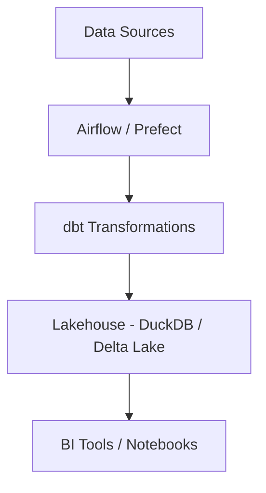

# Calebsons Data Engineering — Lakehouse Pipeline

## Overview
A modern data lakehouse pipeline using Airflow/Prefect, dbt, and DuckDB/Delta Lake.

## Tech Stack
- Airflow / Prefect
- dbt
- DuckDB / Delta Lake
- Python

## Features
- ETL/ELT workflows
- Data transformations
- Orchestration
- BI-ready datasets

## Architecture

## Setup
- Install Airflow/Prefect
- Run dbt seed + run

## Deployment
- Docker Compose
- Cloud Composer (optional)

## Roadmap
- Add streaming ingestion
- Add quality checks
