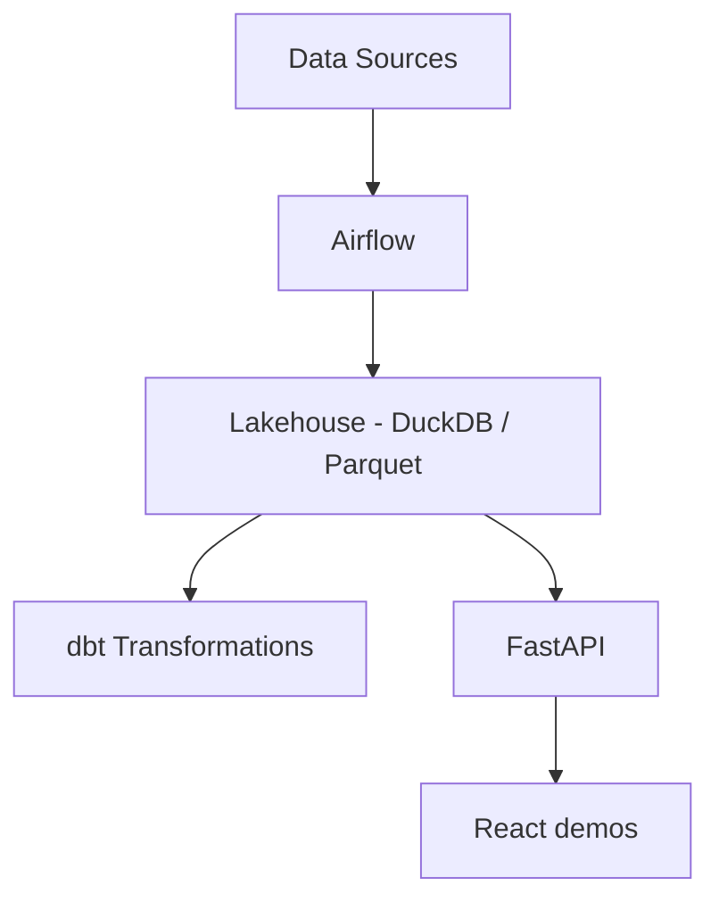

# Calebsons Datalake — Lakehouse Pipeline

## Overview
A modern data lakehouse pipeline using Airflow, dbt, DuckDB, and a React demo UI.

## Tech Stack
- Airflow
- dbt
- DuckDB / Polars
- FastAPI + Vite React

## Features
- ETL/ELT workflows
- Raw source contracts (paths, schemas, freshness SLAs)
- Data transformations
- Orchestration
- BI-ready datasets
- Use-case demo pages in the frontend

## Architecture

```mermaid
flowchart TD
    SRC[Data Sources] --> ORCH[Airflow]
    ORCH --> LAKE[Lakehouse - DuckDB / Parquet]
    LAKE --> DBT[dbt Transformations]
    LAKE --> API[FastAPI]
    API --> UI[React demos]
```

## Setup
See `walkthrough.md` for full install, pipeline, API, and UI steps.

## Deployment
- Docker Compose
- Cloud Composer (optional)

## Roadmap
- Add streaming ingestion
- Add quality checks
