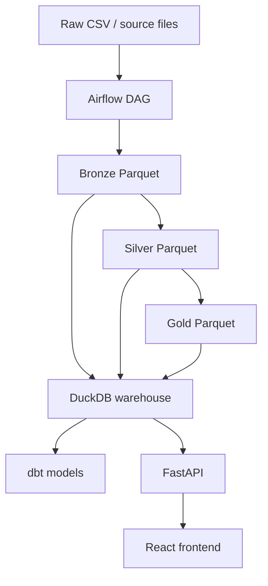

# Calebsons Datalake Pipeline Walkthrough

## Overview

This project is a minimal lakehouse pipeline that moves one sample dataset through four stages:

- `data/raw/` stores the original CSV input
- `data/bronze/` stores the cleaned raw data as Parquet
- `data/silver/` stores typed and filtered records as Parquet
- `data/gold/` stores aggregated analytics as Parquet

The pipeline uses:

- `Polars` for fast dataframe work
- `DuckDB` as the local warehouse and query engine
- `Airflow` to orchestrate the three pipeline steps
- `dbt` to build analytics models on top of the DuckDB warehouse
- `FastAPI` + a Vite React UI to browse lakehouse layers and gold metrics

### Bronze, Silver, and Gold

- Bronze: raw CSV loaded into Parquet with cleaned column names
- Silver: typed, renamed, and filtered business-ready rows
- Gold: aggregated category-level summary for reporting

## Architecture



Data lands in raw storage, Airflow runs the bronze → silver → gold transforms, DuckDB exposes the layers for SQL/dbt, and the FastAPI + React UI lets you inspect the same outputs in a browser.

## Real-Life Use Cases

Each demo is a **separate industry scenario** with its own raw → bronze → silver → gold dataset under `data/scenarios/<slug>/`.

Every demo page shows the **same sections** (layer rail, gold chart, raw/bronze/silver tables, gold rollups). Only the industry dataset and labels change.

Seed (or re-seed) all five datasets:

```bash
source .venv/bin/activate   # or .venv-ui
python transformations/seed_scenarios.py
```

1. **Retail POS reporting** (`/demos/retail-pos-reporting`) — POS tickets → category sales.
2. **Clinic appointment ops** (`/demos/clinic-appointment-ops`) — Appointments → department fees.
3. **Fleet delivery rollups** (`/demos/fleet-delivery-rollups`) — Shipments → hub freight.
4. **Payments quality gate** (`/demos/payments-quality-gate`) — Card payments → channel volume.
5. **SaaS usage onboarding** (`/demos/saas-usage-onboarding`) — Usage events → product seat value.

The shared `/lakehouse` explorer still uses the core sales pipeline under `data/raw|bronze|silver|gold`.

## Setup Instructions

### Python Version

Use Python `3.11`.

### Install Dependencies

The project uses three small Python environments:

```bash
cd /Users/calebthompson/Documents/2/calebsons/calebsons_inc/datalake
python3.11 -m venv .venv
source .venv/bin/activate
pip install --upgrade pip
pip install -r requirements.txt
```

Create the Airflow environment:

```bash
python3.11 -m venv .venv-airflow
source .venv-airflow/bin/activate
AIRFLOW_VERSION=2.8.4
PYTHON_VERSION=3.11
CONSTRAINT_URL="https://raw.githubusercontent.com/apache/airflow/constraints-${AIRFLOW_VERSION}/constraints-${PYTHON_VERSION}.txt"
pip install --upgrade pip
pip install --constraint "${CONSTRAINT_URL}" -r requirements-airflow.txt
```

Create the dbt environment:

```bash
python3.11 -m venv .venv-dbt
source .venv-dbt/bin/activate
pip install --upgrade pip
pip install -r requirements-dbt.txt
```

### Folder Structure

```text
airflow/                 Airflow DAG definition
api/                     FastAPI backend for the lakehouse UI
dbt/                     dbt project, profile, and models
data/raw/                Shared source CSV data
data/bronze/             Shared bronze Parquet output
data/silver/             Shared silver Parquet output
data/gold/               Shared gold Parquet output
data/scenarios/          Per-industry demo datasets (raw/bronze/silver/gold)
frontend/                Vite + React dashboard UI
transformations/         Python ETL scripts
warehouse/               DuckDB warehouse utilities and database file
requirements.txt         Core pipeline + API dependencies
requirements-airflow.txt Airflow dependencies
requirements-dbt.txt     dbt dependencies
walkthrough.md           This guide
```

## Running the Pipeline Manually

Run the scripts from the project root in this order:

```bash
source .venv/bin/activate
python transformations/ingest_raw_to_bronze.py
python transformations/bronze_to_silver.py
python transformations/silver_to_gold.py
```

Expected outputs:

- `data/bronze/sales_orders.parquet`
- `data/silver/sales_orders.parquet`
- `data/gold/category_summary.parquet`
- `warehouse/lakehouse.duckdb`

What each step does:

- `ingest_raw_to_bronze.py` reads `data/raw/sales_orders.csv`, standardizes column names, and writes bronze Parquet
- `bronze_to_silver.py` casts types, renames columns, filters inactive and invalid records, and writes silver Parquet
- `silver_to_gold.py` aggregates by category and writes gold Parquet

## Running Airflow

Initialize Airflow locally from the project root:

```bash
source .venv-airflow/bin/activate
export AIRFLOW_HOME="$(pwd)/airflow"
export AIRFLOW__CORE__DAGS_FOLDER="$(pwd)/airflow"
airflow db migrate
```

Create an Airflow user:

```bash
source .venv-airflow/bin/activate
airflow users create \
  --username admin \
  --firstname Caleb \
  --lastname Sons \
  --role Admin \
  --email admin@example.com \
  --password admin
```

Start the webserver in one terminal:

```bash
source .venv-airflow/bin/activate
export AIRFLOW_HOME="$(pwd)/airflow"
export AIRFLOW__CORE__DAGS_FOLDER="$(pwd)/airflow"
airflow webserver --port 8080
```

Start the scheduler in another terminal:

```bash
source .venv-airflow/bin/activate
export AIRFLOW_HOME="$(pwd)/airflow"
export AIRFLOW__CORE__DAGS_FOLDER="$(pwd)/airflow"
airflow scheduler
```

Open `http://localhost:8080`, log in with `admin` / `admin`, enable the `lakehouse_pipeline` DAG, and trigger it.

Task behavior:

- `ingest_raw_to_bronze` writes bronze Parquet and refreshes the DuckDB warehouse
- `bronze_to_silver` writes silver Parquet and refreshes the DuckDB warehouse
- `silver_to_gold` writes gold Parquet and refreshes the DuckDB warehouse

You can also trigger it from the CLI:

```bash
source .venv-airflow/bin/activate
export AIRFLOW_HOME="$(pwd)/airflow"
export AIRFLOW__CORE__DAGS_FOLDER="$(pwd)/airflow"
airflow dags trigger lakehouse_pipeline
```

## Running dbt

Run the raw-to-gold scripts first so the DuckDB warehouse and source views exist.

From the project root:

```bash
source .venv-dbt/bin/activate
export DBT_DUCKDB_PATH="$(pwd)/warehouse/lakehouse.duckdb"
dbt run --project-dir dbt --profiles-dir dbt
```

What dbt builds:

- `silver_model` reads from the DuckDB `silver_sales` view
- `gold_model` aggregates from `silver_model`

Useful dbt commands:

```bash
source .venv-dbt/bin/activate
export DBT_DUCKDB_PATH="$(pwd)/warehouse/lakehouse.duckdb"
dbt debug --project-dir dbt --profiles-dir dbt
dbt run --project-dir dbt --profiles-dir dbt
dbt test --project-dir dbt --profiles-dir dbt
```

## Testing the Frontend and Backend

Recommended order: **API + UI first**, then pipeline/Airflow/dbt, then unlock demos.

1. Start FastAPI + React (they work alone and show stack status)
2. Run lakehouse transforms + DuckDB warehouse
3. Start Airflow webserver
4. Run dbt once so `dbt/target/manifest.json` exists
5. On the home page, wait until every service is green — demos unlock automatically

The UI reads lakehouse Parquet/CSV layers through a small FastAPI app and polls `/api/status` for readiness.
### Install UI API dependencies

Use a dedicated Python 3.11 env (recommended) or your main `.venv` after `requirements.txt` is installed:

```bash
cd /Users/calebthompson/Documents/2/calebsons/calebsons_inc/datalake
python3.11 -m venv .venv-ui
source .venv-ui/bin/activate
pip install --upgrade pip
pip install -r requirements.txt
```

Install the frontend packages once:

```bash
cd frontend
npm install
```

### Start the backend API

From the project root, in one terminal:

```bash
source .venv-ui/bin/activate
python -m uvicorn api.server:app --reload --port 8000
```

Quick API checks:

```bash
curl http://127.0.0.1:8000/api/health
curl http://127.0.0.1:8000/api/status
curl http://127.0.0.1:8000/api/overview
curl http://127.0.0.1:8000/api/gold
curl "http://127.0.0.1:8000/api/orders?layer=silver"
```

Expected:

- `/api/health` returns `{"status":"ok"}`
- `/api/status` lists API, layers, warehouse, Airflow, and dbt with `ok` true/false and `demos_ready`
- `/api/overview` includes layer row counts plus the same readiness summary
- `/api/gold` / `/api/orders` work once pipeline files exist

Interactive docs: open `http://127.0.0.1:8000/docs`.

### Start the frontend

In a second terminal:

```bash
cd frontend
npm run dev
```

Open `http://127.0.0.1:5173`.

Vite proxies `/api/*` to the backend on port `8000`, so you do not need to hardcode a remote API URL for local testing.

Home (`/`) lists stack readiness and the five use-case demos. Full explorer: `/lakehouse`.

What to verify in the UI:

1. Home loads even if Airflow/dbt are down — status board shows which services are not ready
2. Demo cards stay **locked** until `/api/status` reports `demos_ready: true` (includes seeded industry scenarios)
3. After layers, warehouse, scenarios, Airflow (`:8080`), and a dbt run are ready, demos unlock
4. Each unlocked demo page uses the **same layout** (layers, gold chart, tables, rollups) on **its own industry dataset**:
   - `/demos/retail-pos-reporting` — retail POS
   - `/demos/clinic-appointment-ops` — healthcare appointments
   - `/demos/fleet-delivery-rollups` — logistics shipments
   - `/demos/payments-quality-gate` — fintech payments
   - `/demos/saas-usage-onboarding` — SaaS usage
5. `/lakehouse` still shows the shared sales pipeline counts, gold metrics, and layer table

### Optional one-shot smoke check

With both servers running:

```bash
curl -s http://127.0.0.1:8000/api/health
curl -s -o /dev/null -w "%{http_code}\n" http://127.0.0.1:5173/
curl -s http://127.0.0.1:5173/api/overview | head -c 200
```

You should see `ok`, HTTP `200` for the UI, and JSON overview data through the Vite proxy.

## Querying the Warehouse

Run the provided query script:

```bash
source .venv/bin/activate
python warehouse/query_lakehouse.py
```

Run a custom query:

```bash
source .venv/bin/activate
python warehouse/query_lakehouse.py --sql "select * from silver_sales order by id"
```

Open DuckDB directly:

```bash
duckdb warehouse/lakehouse.duckdb
```

Example SQL queries:

```sql
show tables;
select * from bronze_sales;
select * from silver_sales order by id;
select * from gold_category_summary order by category;
select category, sum(value) as total_value
from silver_sales
group by category
order by category;
```

## Troubleshooting

### Frontend shows “Could not reach the lakehouse API”

Make sure the API is running on port `8000` before (or while) using the UI:

```bash
source .venv-ui/bin/activate
uvicorn api.server:app --reload --port 8000
```

Then confirm:

```bash
curl http://127.0.0.1:8000/api/health
```

If port `8000` is already in use, either stop the other process or start the API on another port and update the Vite proxy in `frontend/vite.config.ts`.

### API returns 404 for a layer

Parquet/CSV files are missing. Rerun the pipeline scripts, then hit `/api/overview` again.

### Airflow import errors

Make sure you installed dependencies with the Airflow constraints file and started Airflow from the project root with:

```bash
source .venv-airflow/bin/activate
export AIRFLOW_HOME="$(pwd)/airflow"
export AIRFLOW__CORE__DAGS_FOLDER="$(pwd)/airflow"
```

### dbt cannot find the database

Set the DuckDB path before running dbt:

```bash
source .venv-dbt/bin/activate
export DBT_DUCKDB_PATH="$(pwd)/warehouse/lakehouse.duckdb"
```

If the database file does not exist yet, run:

```bash
source .venv/bin/activate
python transformations/ingest_raw_to_bronze.py
python transformations/bronze_to_silver.py
python transformations/silver_to_gold.py
```

### Reset the pipeline

From the project root:

```bash
source .venv/bin/activate
rm -f warehouse/lakehouse.duckdb warehouse/lakehouse.duckdb.wal
rm -f data/bronze/*.parquet data/silver/*.parquet data/gold/*.parquet
rm -rf airflow/logs airflow/airflow.db
rm -rf dbt/target dbt/logs
```

Then rerun:

```bash
source .venv/bin/activate
python transformations/ingest_raw_to_bronze.py
python transformations/bronze_to_silver.py
python transformations/silver_to_gold.py
python warehouse/query_lakehouse.py
```
